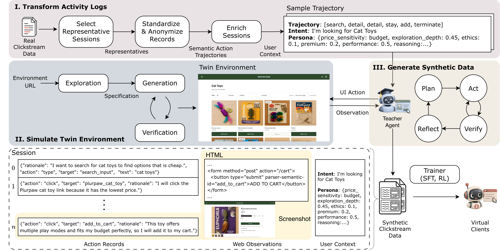

# SIMTRACE

This repository implements **SIMTRACE: Grounded Multimodal User Trajectories Generation for Online User Modeling** paper. SIMTRACE transforms private website activity logs into standardized and anonymized behavioral trajectories, builds a controllable twin of the source website, and uses an LLM teacher agent to generate fine-grained multimodal sessions grounded in both the trajectories and the environment.

Each generated step pairs a structured browser action and rationale with the corresponding HTML, screenshot, intent, and persona. The resulting data support privacy-conscious user modeling, purchase prediction, and session-based recommendation.



*SIMTRACE transforms activity logs into anonymized behavioral guidance, builds a verified twin environment, and generates multimodal interaction trajectories for downstream user modeling.*

## Install dependencies

```bash
conda create -n buyer-smi python=3.12
conda activate buyer-smi
pip install -r requirements.txt
playwright install chromium
```
Environment simulation and GPU training have additional platform-specific dependencies documented in their own READMEs.

## 1. Data collection

The [data collection pipeline](src/data_collection/README.md) ingests activity logs from Microsoft Clarity, PostHog, BigQuery, or a custom processor. It maps provider-specific events to a shared semantic-action taxonomy, pseudonymizes identifiers, abstracts sensitive product attributes, selects representative sessions, and enriches each session with an inferred intent and persona.

The principal outputs are `sessions_raw.csv` for local evaluation, `sessions_external.csv` for the anonymized projection, `products.csv`, and `sessions.jsonl`. See the [complete data collection guide](src/data_collection/README.md) for analytics-provider setup, schemas, anonymization boundaries, and custom processor integration.

## 2. Environment simulation

The [environment simulation pipeline](src/env_sim/README.md) creates a controllable twin of the website so synthetic users can interact without exposing the original environment. It explores the source site, consolidates browser evidence into an intermediate specification, generates a runnable sandbox, and iteratively verifies visual fidelity and action replay.

This component requires Python 3.12+, Node.js 20+, pnpm 9+, `uv`, and a supported coding-agent CLI:

```bash
cd src/env_sim
uv sync
pnpm install
uv run playwright install chromium
pnpm --filter @shop-gym/shop-backend build

uv run shop-explore https://example-shop.com

uv run shop-gen outputs/shop_manuals/<domain>/<run_id> \
  --name simtrace-shop \
  --template react-vite \
  --catalog-source ingest \
  --judges all \
  --clickstream ../../data/processed/sessions_raw.csv

pnpm shop:host start simtrace-shop 4000
```

The sandbox is served at `http://localhost:4000` by default. See the [environment simulation README](src/env_sim/README.md) for model credentials, synthetic-content rewriting, verification thresholds, retry budgets, and deployment controls.

## 3. Data generation

The [data generation pipeline](src/data_gen/README.md) uses an LLM teacher agent to replay the anonymized behavioral guidance inside a live storefront. SIMTRACE's trajectory-conditioned agent maintains session-level coherence through planning and reflection, verifies proposed actions before execution, and records actions, rationales, screenshots, raw and simplified HTML, accessibility trees, and LLM traces.

Set the input `sessions.jsonl`, storefront URL, model, and experiment variants in [`conf/experiments.yaml`](conf/experiments.yaml), export the configured provider credentials, and run:

```bash
export OPENAI_API_KEY="your-api-key"

python -m src.data_gen.main.run_experiments \
  --config conf/experiments.yaml
```

Use `--no-run-eval` for generation only. Results are organized by agent mode and configuration, while `runs_index.jsonl` records each completed run. See the [data generation README](src/data_gen/README.md) for agent modes, reflection and verification controls, record schemas, resume behavior, and fidelity evaluation.

## 4. Downstream Tasks

### User model: next-action prediction

The primary downstream application is the [SIMTRACE user model](user_model/README.md). It learns to predict a user's next structured browser action and rationale from the current HTML observation, persona, intent, and interaction history. The paper evaluates Qwen3.5-9B in a low-resource setting using three SFT regimes—real only, synthetic only, and real plus synthetic—and then aligns the synthetic-SFT checkpoint to real behavior with GDPO reinforcement learning.

Synthetic supervision broadens interface-target coverage, while the RL rewards combine action correctness, valid output structure, target validity, exact match, and hierarchical target similarity. Evaluation reports exact action-and-target match, action-type F1, and action-type accuracy on the same held-out OPeRA split.

Install the dedicated training stack and prepare synthetic sessions for SFT:

```bash
pip install -r user_model/requirements.txt

python -m user_model.sft.data_prep \
  --synthetic_repo <huggingface-org>/buyer-sim-250-test \
  --output_dir data/sft/buyer-sim-250
```

Then launch an SFT arm by overriding the dataset and output paths:

```bash
CUDA_VISIBLE_DEVICES=0,1 accelerate launch \
  --config_file user_model/sft/accelerate_config.yaml \
  -m user_model.sft.trainer \
  --config user_model/sft/config.yaml \
  --train_datasets data/sft/buyer-sim-250 \
  --eval_dataset <huggingface-org>/opera-50-sft \
  --output_dir ckpt/sft/synth
```

Evaluate a trained checkpoint with:

```bash
python -m user_model.inference \
  --config user_model/sft/config.yaml \
  --data data/sft/opera-50/sft_eval.jsonl \
  --split test \
  --adapter_path <checkpoint-or-adapter-path>
```

The [user-model README](user_model/README.md) contains the complete synthetic/real/mixed SFT matrix, OPeRA preparation, multi-GPU vLLM and GDPO launch sequence, reward configuration, and evaluation workflow.

### Purchase prediction

[Purchase prediction](purchase_intent_pred/README.md) tests whether synthetic clickstreams preserve the signal needed to predict whether a session ends in purchase or termination. It compares train-real/test-real (TRTR) and train-synthetic/test-real (TSTR) Qwen3.5-4B QLoRA models on the same held-out real sessions.

See the [purchase prediction README](purchase_intent_pred/README.md) for the data contract, leakage controls, QLoRA configuration, and evaluation metrics.

### Session-based recommendation

[Session-based recommendation](session_based_recom/README.md) evaluates whether synthetic sessions can train next-item recommenders that transfer to held-out real sessions. The experimental protocol covers ID-based and multimodal methods and reports MRR and Hit Rate at 5 and 10. This repository provides data preparation and result-analysis utilities; recommender models are obtained from their upstream repositories.

See the [recommendation README](session_based_recom/README.md) for matched-vocabulary construction, multimodal features, and paired statistical evaluation. The [external methods reference](session_based_recom/methods/README.md) lists upstream sources, paper references, and setup instructions.

## Contact

For inquiries regarding SIMTRACE, its implementation, or the reproduction of the reported experiments, please contact Yunan Lu at [yl4021@columbia.edu](mailto:yl4021@columbia.edu).

## License

SIMTRACE is licensed under the [MIT License](LICENSE).
