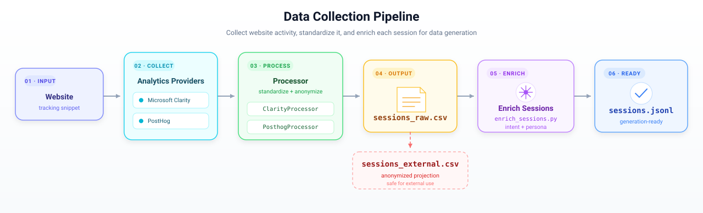

# Data collection

This package turns buyer activity from a website analytics source into the
standardized, anonymized, and enriched session data consumed by
`buyer-sim-gen`.



The pipeline is source- and website-agnostic:

| Stage | Purpose | Main code | Output |
|---|---|---|---|
| **1. Collect** | Record or query session-level page views, clicks, and commerce events, with the website product catalog | provider instrumentation, catalog export, or an existing warehouse table | provider-native events, `products.csv` |
| **2. Standardize and anonymize** | Map events to the shared `semantic_action` vocabulary, pseudonymize identifiers, and remove plaintext fields from the shareable projection | [`processor.py`](processor.py) and its subclasses | `sessions_raw.csv`, `sessions_external.csv` |
| **3. Enrich sessions** | Aggregate buyer features, derive trajectories and intents, and generate personas | [`enrich_sessions.py`](enrich_sessions.py), [`generate_personas.py`](generate_personas.py) | `buyers_feature.json`, `sessions.jsonl` |

Runnable examples of the final artifacts live in [`sample/`](sample/).

## 1. Collect website activity

The standardization stage needs session identifiers, timestamps, page URLs or
equivalent navigation fields, and event/click details. Any collection tool is
valid if its processor can translate that source schema into the common rows.

Built-in sources:

- Microsoft Clarity recordings: [`clarity_processor.py`](clarity_processor.py)
- PostHog events queried with HogQL: [`posthog_processor.py`](posthog_processor.py)
- (Customized) BigQuery events or a previously exported flat CSV based on the Processor base:
  [`bigquery_processor.py`](bigquery_processor.py)

### Persona-tagged traffic

For browser-collected demonstrations, the entry URL can carry
`?persona=<id>`. The Clarity and PostHog processors preserve that value as the
join key used by persona enrichment. For example:

```text
https://example.com/?persona=39
```

### Demonstration: instrumenting a Shopify store

Shopify is one example deployment. The following
setup demonstrates how provider data can be collected from a commerce website. Here is an example store we provide to demonstrate how to set it up.

For Microsoft Clarity:

1. Create a project at [clarity.microsoft.com](https://clarity.microsoft.com).
2. In the Shopify's theme editor, add the provider's web loader before </head> in layout/theme.liquid and enable both page views and click autocapture. Specifically, 
  ```html 
   <script type="text/javascript">
      (function(c,l,a,r,i,t,y){
          c[a]=c[a]||function(){(c[a].q=c[a].q||[]).push(arguments)};
          t=l.createElement(r);t.async=1;t.src="https://www.clarity.ms/tag/"+i;
          y=l.getElementsByTagName(r)[0];y.parentNode.insertBefore(t,y);
      })(window, document, "clarity", "script", "w4lsckbhdd");

      // Tag this Clarity session with a persona ID from the URL param
      var params = new URLSearchParams(window.location.search);
      var persona = params.get("persona");
      if (persona) {
          clarity("set", "persona", persona);
      }
    </script>
   ```
3. Create an API token and export it before running the processor:

   ```bash
   export CLARITY_API_TOKEN="your-token-here"
   ```

For PostHog:

1. Create a project at [posthog.com](https://posthog.com).
2. Add the provider's web loader before `</head>` in `layout/theme.liquid` and
   enable both page views and click autocapture:

   ```html
   <script>
      !function(t,e){var o,n,p,r;e.__SV||(window.posthog&&window.posthog.__loaded)||(window.posthog=e,e._i=[],e.init=function(i,s,a){function g(t,e){var o=e.split(".");2==o.length&&(t=t[o[0]],e=o[1]),t[e]=function(){t.push([e].concat(Array.prototype.slice.call(arguments,0)))}}(p=t.createElement("script")).type="text/javascript",p.crossOrigin="anonymous",p.async=!0,p.src=s.api_host.replace(".i.posthog.com","-assets.i.posthog.com")+"/static/array.js",(r=t.getElementsByTagName("script")[0]).parentNode.insertBefore(p,r);var u=e;for(void 0!==a?u=e[a]=[]:a="posthog",u.people=u.people||[],u.toString=function(t){var e="posthog";return"posthog"!==a&&(e+="."+a),t||(e+=" (stub)"),e},u.people.toString=function(){return u.toString(1)+".people (stub)"},o="init capture register identify".split(" "),n=0;n<o.length;n++)g(u,o[n]);e._i.push([i,s,a])},e.__SV=1)}(document,window.posthog||[]);

      posthog.init('<YOUR_POSTHOG_PROJECT_API_KEY>', {
        api_host: 'https://us.i.posthog.com',
        person_profiles: 'always',
        loaded: function(ph) {
          var params = new URLSearchParams(window.location.search);
          var persona = params.get("persona");
          if (persona) {
            var stored = localStorage.getItem("ph_persona");
            if (persona !== stored) {
              ph.reset();
              ph.sessionManager.resetSessionId();
              localStorage.setItem("ph_persona", persona);
            }
            ph.register({ persona: persona });
          }
        }
      });
    </script>
   ```

3. Create a personal API key with `project:read` and `query:read`, then export
   it:

   ```bash
   export POSTHOG_API_KEY="phx_..."
   ```

### Product catalog

The product catalog is a required pipeline input. It connects product URLs to
categories, exact prices, and price buckets; processors stop before collection
if the file or required columns are missing. The CSV must contain
`product_handle`, `product_title`, `product_type`, and `price` columns. Rows
without `product_title` are ignored. Products with a missing type or price are
kept, but their category, price bucket, and enriched price remain blank.

[`sample/products.csv`](sample/products.csv) is a complete transformed example
with the full supported export schema. Use a catalog exported from the website
being processed for a real run; the sample is only a format reference.

## 2. Standardize and anonymize

### The `Processor` contract

[`Processor`](processor.py) owns the behavior shared by all sources:

- deterministic pseudonymization and hashing;
- common commerce URL and click classification;
- noise cleanup;
- raw and external schemas; and
- CSV output and provider-neutral `buyers_feature.json` aggregation.

Each source implements `fetch()` and `transform_to_clickstream()`. The BigQuery
processor and new integrations put source-specific settings in the `meta_arg`
mapping rather than expanding the common constructor API.

```text
Processor
├── ClarityProcessor
├── PosthogProcessor
└── BigQueryProcessor
```

### How to customize a processor?

```python
from pathlib import Path

from src.data_collection.catalog import load_catalog
from src.data_collection.processor import Processor


class MyAnalyticsProcessor(Processor):
    source_name = "my-analytics"
    output_prefix = "my_"

    def fetch(self) -> list[dict]:
        api_url = self.get_meta_arg("api_url")
        project = self.get_meta_arg("project")
        # Authenticate and return provider-native records.
        ...

    def transform_to_clickstream(self, raw: list[dict]) -> list[dict]:
        rows = []
        for event in raw:
            # Reuse self.make_row(), self.infer_pageview_action(),
            # self.classify_click(), and self.extract_persona().
            ...
        return rows


processor = MyAnalyticsProcessor(
    catalog=load_catalog("path/to/products.csv"),
    meta_arg={"api_url": "https://analytics.example/api", "project": "demo"}
)
processor.run(Path("output"))
```

The shared `run()` method writes the two clickstream CSVs and
`buyers_feature.json`, so new processors receive the same feature output by
default.

To expose the new class through the one-command workflow, add its name and
source-specific CLI arguments to [`main.py`](main.py), then construct it there
with `catalog=...` and `meta_arg=...`. The shared caller can use the returned
rows and `persona_id_by_session()` to perform the same enrichment step without
adding a second CLI to the processor module.

Keep credentials, table names, project identifiers, and provider-only filters
inside `meta_arg`. Extend `raw_fields` or `external_fields` on the subclass only
when the source needs additional output columns.

### Semantic actions

| Action | Meaning |
|---|---|
| `explore-search` | Search submission or search-result navigation |
| `explore-goto` | Navigation to a new non-product page |
| `explore-back` | Return to a previously visited page |
| `explore-stay` | Browse or dwell on the current page |
| `detail` | Product detail view |
| `add` | Add to cart |
| `checkout` | Begin or complete checkout |
| `remove` | Remove from cart |
| `terminate` | Synthetic session end |

### Anonymization boundary

`sessions_raw.csv` retains fields needed for local inspection. The shareable
`sessions_external.csv` keeps only:

```text
session_id, user_id, store_id, timestamp, semantic_action, product_hash,
product_category, price_bucket, url_hash, persona
```

Plaintext URLs, raw actions, product handles, exact prices, and creation times
do not cross this boundary.

## 3. Run the complete pipeline

Use the same entry point for every source. `--processor` controls which class is
created; source-specific command-line values are passed to that class through
its `meta_arg` mapping. The processor writes the clickstream CSVs and buyer
features, then the caller runs enrichment exactly once.

### Microsoft Clarity

```bash
export CLARITY_API_TOKEN="your-token-here"
python -m src.data_collection.main \
  --processor clarity \
  --catalog path/to/products.csv \
  --start 2026-03-01 \
  --end 2026-03-31 \
  --output-dir output
```

### PostHog

```bash
export POSTHOG_API_KEY="phx_..."
python -m src.data_collection.main \
  --processor posthog \
  --catalog path/to/products.csv \
  --project-id 386541 \
  --start 2026-04-15 \
  --end 2026-04-17 \
  --output-dir output
```

When a session contains a `?persona=<id>` tag, that value is the feature key;
otherwise the processor derives a stable key from the anonymized user and
website identifiers.

### BigQuery

`BigQueryProcessor` follows the same base contract but constructs its required
`products.csv` from the warehouse events and merchandising catalog.

Query a table directly:

```bash
python -m src.data_collection.main \
  --processor bigquery \
  --project analytics-project \
  --table analytics-project.dataset.buyer_events_sessions \
  --shop-id 12345 \
  --sample-sessions 900 \
  --output-dir output
```

Or process a flat export without BigQuery access:

```bash
python -m src.data_collection.main \
  --processor bigquery \
  --input-csv path/to/events.csv \
  --sample-sessions 900 \
  --output-dir output
```

The warehouse schema happens to call its website identifier `shop_id`; custom
processors can use any equivalent source field through their own `meta_arg`.

Each command above produces `sessions_raw.csv`, `sessions_external.csv`,
`buyers_feature.json`, and the final `sessions.jsonl`. BigQuery also writes its
generated `products.csv`, complete clickstream, and data-quality report.

BigQuery uses its richer normalized events for buyer-feature aggregation;
Clarity and PostHog use the provider-neutral clickstream aggregation. In every
case, the unified caller derives trajectories and intents and calls
`generate_personas()` only once.

The persona schema and prompt live in [`persona_prompt.py`](persona_prompt.py).

### Output schema

```json
{
  "session_id": "1cd49b89-47b8-51b6-8d0c-4c5a2c55930f",
  "trajectory": ["explore-stay", "detail", "checkout", "terminate"],
  "product_categories": ["Aprons"],
  "price_bucket": [1],
  "intent": "I'm looking for Aprons",
  "persona_id": "39",
  "persona": "{\"buyer_id\": \"39\", ...}"
}
```

See [`sample/sessions.jsonl`](sample/sessions.jsonl) for complete examples.
